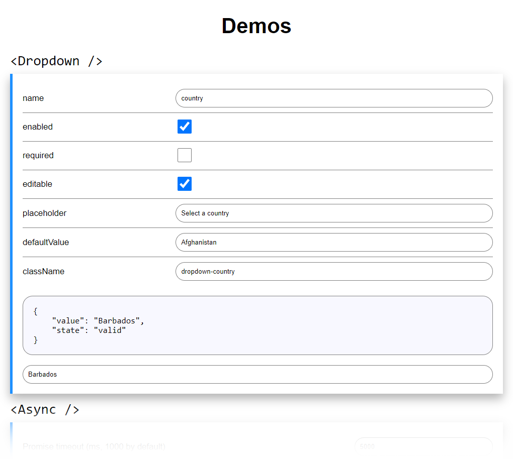

# React UI demo

## Installation
1. Pack the module by running `npm pack` in the root directory
1. Go to the `demo` directory and install the packed module by running `npm install ../stein197-react-ui-1.4.0.tgz`
1. Run `npm run build`
1. Run `npm run server`
1. Open `localhost:8080` to see the demo

## NPM scripts
- `sass` - compile SASS source code
- `sass:watch` - same as `sass` but watches for changes
- `ts` - compile TypeScript source code
- `ts:watch` - same as `ts` but watch for changes
- `build` - `sass` + `ts`
- `server` - run local server on port 8080

